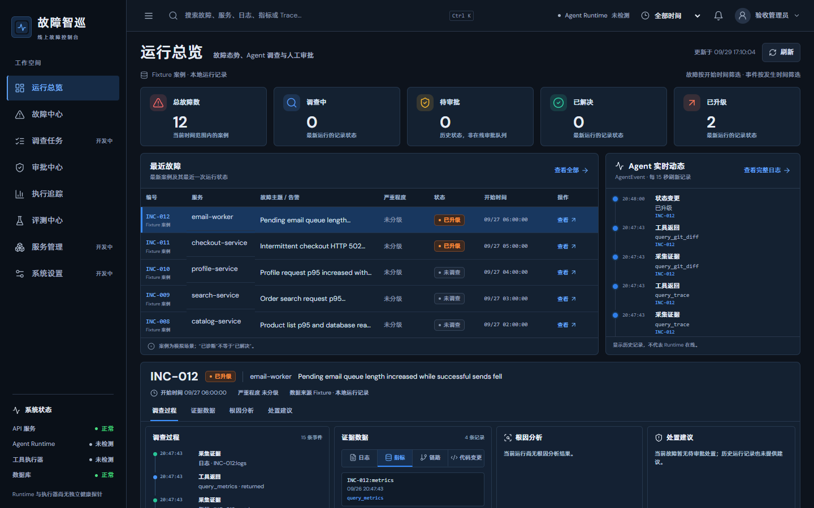
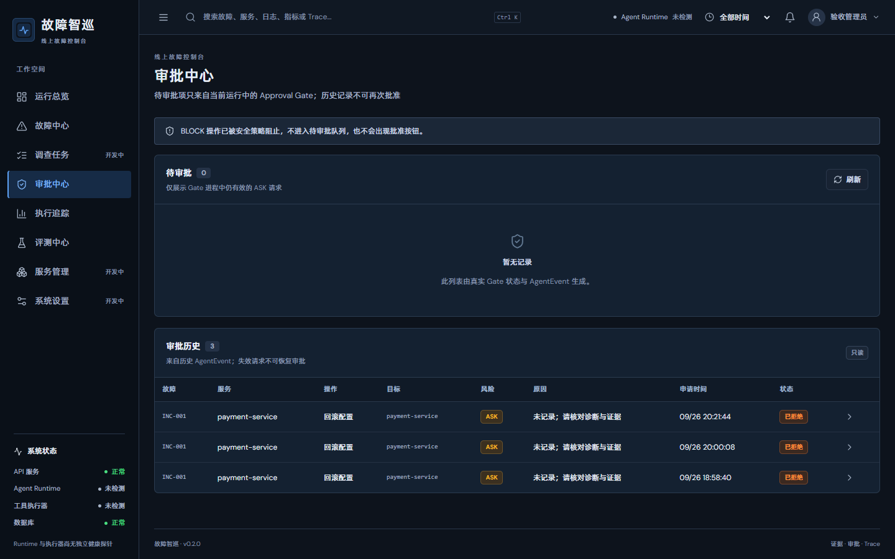
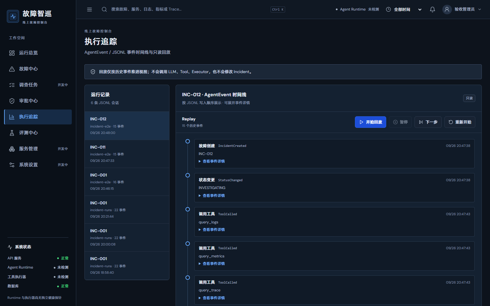
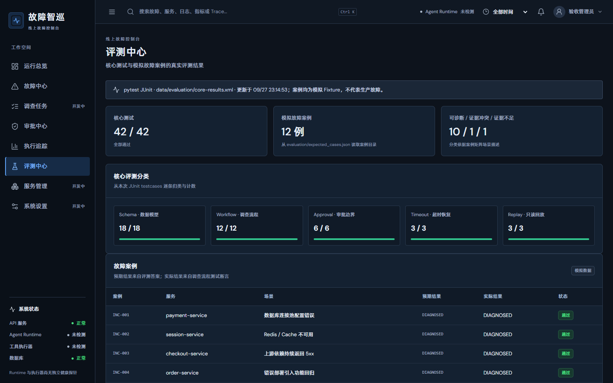

<p align="center"></p>

<h1 align="center">故障智巡</h1>

<p align="center"><strong>从故障信号到可核查的处置决策</strong><br />AI 线上服务故障排查与处置平台 · Incident Response Agent</p>

<p align="center">
  <a href="#产品界面">产品界面</a> ·
  <a href="#architecture">系统架构</a> ·
  <a href="#evaluation">评测与验证</a> ·
  <a href="#demo故障智巡正在调查-inc-001">运行 Demo</a> ·
  <a href="docs/project-ownership.md">能力归属</a>
</p>

故障智巡以 **Incident 为中心**组织调查：通过只读工具采集日志、指标、链路与变更，形成可追溯的 Evidence；诊断必须引用已收集的证据。证据冲突或不足时，流程升级人工复核。涉及处置的 ToolCall 先经过 `SAFE / ASK / BLOCK` 策略；`ASK` 由可信宿主审批，`BLOCK` 直接阻止。关键状态与决策写入 `AgentEvent` / JSONL，可按历史事件只读回放。

> **项目阶段：可运行的模拟故障演示与确定性验收。** 目前使用仓库内 Fixture，处置 Executor 只执行模拟动作；尚未接入生产监控或真实服务操作。

| 只读取证 | 模拟案例 |    核心验收     |            处置边界             |
| :------: | :------: | :-------------: | :-----------------------------: |
| 4 个工具 |  12 例   | 42 项确定性测试 | `SAFE / ASK / BLOCK` + 人工审批 |

## 产品界面

以下截图来自仓库的 **1440 × 900 桌面端浏览器验收**。页面读取模拟案例目录和本地运行记录；图中的状态、事件与评测结果是该验收环境的快照，不代表实时生产服务。当前为统一的故障控制台，包含使用者视角的总览和管理审计视角的审批、追踪、评测页面。

### 运行总览 · 从告警进入调查

故障列表、状态统计、Agent 事件动态和单个 Incident 的证据详情在同一屏展开。



<details>
<summary><strong>展开查看：审批中心、执行追踪与评测中心</strong></summary>

### 审批中心 · 高风险动作交给人

只展示当前 Gate 中有效的 `ASK` 请求；历史审批只读呈现，`BLOCK` 不进入待审批队列。截图中无待审批项，历史记录来自本地事件。



### 执行追踪 · 用事件还原过程

按运行记录查看 `AgentEvent` 时间线，并逐步回放历史事件；Replay 不会再次调用模型、工具或处置执行器。



### 评测中心 · 结果和边界一起呈现

展示 12 个模拟案例、核心测试分类及本地 JUnit 产物。截图中的 `42 / 42` 是当次验收环境的结果，不是线上故障处置成功率。



</details>

## Architecture

```text
Incident Response System（故障智巡）
├─ Incident Domain       Incident 模型与状态机
├─ Investigation         故障调查流程与取证 ToolCall
├─ Evidence              Fixture、只读查询与结构化证据
├─ Diagnosis             证据引用校验、根因分析或升级
├─ Policy / Approval     SAFE / ASK / BLOCK、人工审批与模拟处置
├─ Trace / Replay        AgentEvent、JSONL 与只读回放
├─ Evaluation            12 个案例与确定性核心测试
└─ Agent Runtime         MiniClaw-derived runtime
   └─ Pi Runtime、Provider、Session、Context、通用 Tool Calling
```

这张图描述系统责任层次，不表示每一层都是独立服务。底层复用 MiniClaw 的 Agent Runtime、Tool Calling 和宿主基础；本项目主要构建 Incident Domain、Evidence Investigation、Safety Policy、Human Approval、AgentEvent Trace、Replay 与 Evaluation。详细归属及代码位置见 [`docs/project-ownership.md`](docs/project-ownership.md)。

## Investigation Workflow

故障调查从 Incident 进入受限 Agent 会话。取证工具读取 Fixture 后返回带来源、时间和 ID 的 Evidence；诊断引用已收集的 Evidence，证据冲突或不足时升级人工复核。随后提出的处置请求在执行前进入风险策略和 Approval Gate，批准只允许可信宿主发起。主要实现位于 [`incident_agent/`](incident_agent/) 与 [`container/agent-runner/src/`](container/agent-runner/src/)。

## Evidence Tools

四个只读工具通过现有 MCP Tool Layer 调用 [`incident_agent/fixtures/`](incident_agent/fixtures/) 中的数据；查询结果被整理为带来源、时间和 ID 的 Evidence。

| Tool             | 返回的模拟证据                       |
| ---------------- | ------------------------------------ |
| `query_logs`     | 故障窗口内的日志                     |
| `query_metrics`  | 指标时间序列                         |
| `query_trace`    | 请求链路；也可能为空                 |
| `query_git_diff` | 相关配置或代码变更；也可能无相关变更 |

数据模型见 [`incident_agent/models.py`](incident_agent/models.py)，Fixture Loader 与工具实现见 [`incident-evidence-tools.ts`](container/agent-runner/src/incident-evidence-tools.ts)。正常或空结果同样是调查结果，不会被强行解释为异常。

## Safety

策略在工具执行前判定，实现在 [`incident-approval-gate.ts`](container/agent-runner/src/incident-approval-gate.ts)：

| 决策    | 当前工具                                              | 行为                               |
| ------- | ----------------------------------------------------- | ---------------------------------- |
| `SAFE`  | 四个 `query_*` 工具                                   | 允许只读 Fixture 查询              |
| `ASK`   | `restart_service`、`rollback_config`、`modify_config` | 创建待审批请求；Agent 自己不能批准 |
| `BLOCK` | `delete_database` 及未知或策略异常的调用              | 拒绝执行                           |

**Fail-Closed：**策略读取失败、审批状态不可用或审批记录不一致时，处置不会进入 Executor。`allow` / `reject` 只由可信宿主调用，不注册为 Agent 工具。即使人工批准，当前 Executor 也仅运行 [`incident-remediation-tools.ts`](container/agent-runner/src/incident-remediation-tools.ts) 中的模拟动作，不操作真实服务。状态流转由 [`incident_agent/state_machine.py`](incident_agent/state_machine.py) 约束。

## Trace & Replay

`AgentEvent` 记录状态变化、工具调用与结果、Evidence、诊断、审批和模拟动作。[`incident_agent/events.py`](incident_agent/events.py) 将事件逐行写入 JSONL；[`incident_agent/replay.py`](incident_agent/replay.py) 根据记录重建时间线、最终状态、证据和审批结果。**Replay 不重新调用 LLM、Tool 或 Executor，也不执行处置。**

工具超时会产生失败事件；已有 Evidence 保留，后续查询仍可继续。有关单次真实模型运行的 ToolCalls、Evidence、状态和 JSONL 路径，见 [`docs/demo.md`](docs/demo.md)。

## Evaluation

[`incident_agent/fixtures/`](incident_agent/fixtures/) 包含 `INC-001` 至 `INC-012`，每例都按同一结构提供 Incident、Logs、Metrics、Trace 和 Git Diff：

- `INC-001`～`INC-010`：10 个有可推导根因的案例。
- `INC-011`：日志与 Trace 对同一调用给出冲突证据，预期升级人工复核。
- `INC-012`：缺少关键因果证据，预期升级人工复核。

评测答案单独位于 [`evaluation/expected_cases.json`](evaluation/expected_cases.json)，由测试读取；事故 Fixture Tool Adapter 只读取各案例目录。真实 Demo 进一步将 Agent 工具限制在四个查询工具和受审批控制的模拟处置工具。案例设计见 [`docs/incident-case-matrix.md`](docs/incident-case-matrix.md)。

| Core test group |   数量 | 测试文件                                                                          |
| --------------- | -----: | --------------------------------------------------------------------------------- |
| Schema          |     18 | [`test_models.py`](incident_agent/tests/test_models.py)                           |
| Workflow        |     12 | [`test_workflow_acceptance.py`](incident_agent/tests/test_workflow_acceptance.py) |
| Approval        |      6 | [`test_approval_boundary.py`](incident_agent/tests/test_approval_boundary.py)     |
| Timeout         |      3 | [`test_timeout_recovery.py`](incident_agent/tests/test_timeout_recovery.py)       |
| Replay          |      3 | [`test_replay_acceptance.py`](incident_agent/tests/test_replay_acceptance.py)     |
| **合计**        | **42** | `core` marker 定义于 [`pytest.ini`](pytest.ini)                                   |

Workflow 测试使用基于已返回 Evidence 的脚本化 planner，不依赖外部 LLM API；Fixture → Tool Layer → Evidence → Workflow / State → Diagnosis / Escalation 仍实际运行。这个机制保证 CI 可以重复验证，不代表每次真实模型运行都必然给出相同措辞或判断。

以下命令在仓库根目录运行。需要 Node.js ≥ 20 和 Python 3.13；其他系统请使用对应的 `python`、虚拟环境路径和 Shell 命令。根目录与 Agent Runner 各有独立的 npm 依赖，缺少后者会使 ToolCall 测试报 `Cannot find package 'typebox'`。

```powershell
py -3.13 -m venv .venv
.\.venv\Scripts\python.exe -m pip install -r incident_agent/requirements.txt
npm ci
npm --prefix container/agent-runner ci
.\.venv\Scripts\python.exe -m pytest incident_agent/tests/test_approval_boundary.py -q
.\.venv\Scripts\python.exe -m pytest -m core -q
.\.venv\Scripts\python.exe -m pytest -q
```

`python -m pytest -m core -q` 与激活虚拟环境后运行 `pytest -m core -q` 等价。核心验收目标是 `42 passed`；仓库还有不计入核心数字的辅助测试。上面的审批测试应为 `6 passed`：它通过真实 ToolCall 触发 `ASK`，检查未审批和被拒绝时 Executor 都没有执行。

## Demo：故障智巡正在调查 INC-001

真实 LLM Demo **需要读者自己的有效模型凭据**；全新克隆没有 Provider 配置时会以 `live_runner_failed` / `FAILED` 结束，只记录失败事件，不能算调查成功。先在仓库根目录安装 Web 依赖并构建，在另一个终端保持本地服务运行：

```powershell
npm --prefix web ci
npm run build:all
npm start
```

浏览器打开 `http://127.0.0.1:3000`，完成管理员初始化，在 **设置 → 模型配置** 中添加并启用有权限调用的 Provider，设为默认并保存自己的 API Key。凭据只在本地配置页面填写，不要写入命令、截图或 Git；如不测试真实模型，可跳过此步骤，仅运行上面的确定性验收。然后在仓库根目录的新终端运行真实 Pi Runtime + LLM 的 `INC-001` 调查；该命令不使用测试 Fake LLM：

```powershell
.\.venv\Scripts\python.exe -m incident_agent.demo_live INC-001
```

命令输出包含 `tool_calls`、`evidence_ids`、`final_status` 和 `jsonl_file`。每次运行的 JSONL 在 `data/incident-e2e/INC-001-<运行 ID>/INC-001.jsonl`，同目录的 `run.json` 保存完整结果。Windows PowerShell 可查看最近一次 `INC-001` 的 Trace，并从**同一文件**回放：

```powershell
$trace = Get-ChildItem data/incident-e2e -Filter INC-001.jsonl -Recurse | Sort-Object LastWriteTime -Descending | Select-Object -First 1
Get-Content $trace.FullName
.\.venv\Scripts\python.exe -c "from pathlib import Path; from incident_agent.replay import load_events,reconstruct_runs,render_replay; p=Path(r'$($trace.DirectoryName)'); print(render_replay('INC-001',reconstruct_runs(load_events('INC-001',p))))"
```

`.\.venv\Scripts\python.exe -m incident_agent.replay INC-001` 是另一条现有 CLI，默认读取 `data/incident-runs/INC-001.jsonl`，用于 [`demo_stage4.py`](incident_agent/demo_stage4.py) 生成的记录；它不会自动查找上面的 `incident-e2e` 独立运行目录。三个真实模型案例的已记录结果见 [`docs/demo.md`](docs/demo.md)。

## Project Boundary

- 全部故障数据来自本仓库 Fixture；没有连接真实生产 Logs、Metrics、Trace、Git 或告警系统。
- Remediation 仅为模拟执行；这里的人工审批是可信宿主侧的审批门槛，不表示已接入真实运维审批平台。
- 12 项 Workflow 测试是确定性评测；真实 LLM Demo 的输出可能变化。
- 本项目用于演示和评测，**不宣称 production-ready**。通用 MiniClaw 工作区的文件权限取决于上游配置；本项目的 Ground Truth 隔离是针对事故 Fixture Tool Adapter 与受限 Demo 路径。

## Future Integration

未来可通过 Adapter 接入 Prometheus、Loki、OpenTelemetry 和真实 Git Provider，替换 Fixture 数据源。这些接入目前**尚未实现**。

## Runtime Notes

Agent Loop、Provider、Session、Context 和通用 Tool Calling 由导入的 MiniClaw 基线及其 Pi 依赖提供；本项目通过其接入点加入 Incident 取证与审批流程，没有从零实现这些 Runtime 能力。根目录的通用包名、接口名、环境变量及工作区存储键沿用原实现，以保持兼容。能力归属以 [`docs/project-ownership.md`](docs/project-ownership.md) 为准。

## Acknowledgements

感谢 [MiniClaw 上游项目](https://github.com/helsome/miniclaw) 及其贡献者。本仓库复用其 Agent Runtime、通用 Tool Calling、Provider/Session 与宿主基础，并在此基础上构建故障调查与处置系统。

## Open Source Attribution

MiniClaw 代码的原版权声明与 MIT 许可证完整保留在 [`LICENSE`](LICENSE)；补充来源说明见 [`NOTICE`](NOTICE)。本项目新增的 Incident Domain、Evidence Investigation、Safety Policy、Human Approval、AgentEvent Trace、Replay 和 Evaluation 不代表上游 Runtime 由本项目从零实现。
