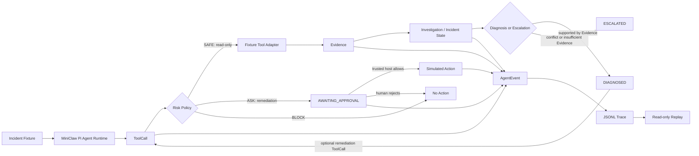

# Incident Response Agent

基于 [MiniClaw](https://github.com/helsome/miniclaw) 构建的**可控线上服务故障调查与处置 Agent**。它从模拟故障数据中调用工具取证，给出有证据引用的诊断；高风险处置须经过人工审批，执行历史可回放。

**快速了解：**4 个只读取证工具 · 12 个模拟故障案例 · 42 项确定性核心测试 · 处置仅为模拟执行。

## Problem

让 LLM 直接阅读告警并给出处置，容易遇到三个问题：缺少可核查的 Logs、Metrics、Trace、Git Diff 证据；模型建议的高风险动作不能直接执行；事后难以还原它调用了什么工具、依据什么证据、状态如何变化。本项目用结构化 Evidence、执行前策略和 AgentEvent 记录这些边界。

## Core Workflow



调查与处置是两个步骤：取证工具先经过 `SAFE` 检查；诊断或升级由 Evidence 驱动；如果随后提出处置请求，`ASK` 会停在审批点，`BLOCK` 会拒绝。事件在调查和审批过程中持续产生，Replay 只读取已记录的事件。主要实现位于 [`incident_agent/`](incident_agent/) 与 [`container/agent-runner/src/`](container/agent-runner/src/)。

## Evidence Tools

四个工具通过 MiniClaw 的 MCP Tool Layer 调用 [`incident_agent/fixtures/`](incident_agent/fixtures/) 中的数据；查询结果被整理为带来源、时间和 ID 的 Evidence。

| Tool | 返回的模拟证据 |
| --- | --- |
| `query_logs` | 故障窗口内的日志 |
| `query_metrics` | 指标时间序列 |
| `query_trace` | 请求链路；也可能为空 |
| `query_git_diff` | 相关配置或代码变更；也可能无相关变更 |

数据模型见 [`incident_agent/models.py`](incident_agent/models.py)，Fixture Loader 与工具实现见 [`incident-evidence-tools.ts`](container/agent-runner/src/incident-evidence-tools.ts)。正常或空结果同样是调查结果，不会被强行解释为异常。

## Safety

策略在工具执行前判定，实现在 [`incident-approval-gate.ts`](container/agent-runner/src/incident-approval-gate.ts)：

| 决策 | 当前工具 | 行为 |
| --- | --- | --- |
| `SAFE` | 四个 `query_*` 工具 | 允许只读 Fixture 查询 |
| `ASK` | `restart_service`、`rollback_config`、`modify_config` | 创建待审批请求；Agent 自己不能批准 |
| `BLOCK` | `delete_database` 及未知或策略异常的调用 | 拒绝执行 |

**Fail-Closed：**策略读取失败、审批状态不可用或审批记录不一致时，处置不会进入 Executor。`allow` / `reject` 只由可信宿主调用，不注册为 Agent 工具。即使人工批准，当前 Executor 也仅运行 [`incident-remediation-tools.ts`](container/agent-runner/src/incident-remediation-tools.ts) 中的模拟动作，不操作真实服务。状态流转由 [`incident_agent/state_machine.py`](incident_agent/state_machine.py) 约束。

## Trace & Replay

`AgentEvent` 记录状态变化、工具调用与结果、Evidence、诊断、审批和模拟动作。[`incident_agent/events.py`](incident_agent/events.py) 将事件逐行写入 JSONL；[`incident_agent/replay.py`](incident_agent/replay.py) 根据记录重建时间线、最终状态、证据和审批结果。**Replay 不重新调用 LLM、Tool 或 Executor，也不执行处置。**

工具超时会产生失败事件；已有 Evidence 保留，后续查询仍可继续。有关单次真实模型运行的 ToolCalls、Evidence、状态和 JSONL 路径，见 [`docs/demo.md`](docs/demo.md)。

## Evaluation

[`incident_agent/fixtures/`](incident_agent/fixtures/) 包含 `INC-001` 至 `INC-012`，每例都按同一结构提供 Incident、Logs、Metrics、Trace 和 Git Diff：

- `INC-001`～`INC-010`：10 个有可推导根因的案例。
- `INC-011`：日志与 Trace 对同一调用给出冲突证据，预期升级人工复核。
- `INC-012`：缺少关键因果证据，预期升级人工复核。

评测答案单独位于 [`evaluation/expected_cases.json`](evaluation/expected_cases.json)，由测试读取；事故 Fixture Tool Adapter 只读取各案例目录。真实 Demo 进一步将 Agent 工具限制在四个查询工具和受审批控制的模拟处置工具。案例设计见 [`docs/incident-case-matrix.md`](docs/incident-case-matrix.md)。

| Core test group | 数量 | 测试文件 |
| --- | ---: | --- |
| Schema | 18 | [`test_models.py`](incident_agent/tests/test_models.py) |
| Workflow | 12 | [`test_workflow_acceptance.py`](incident_agent/tests/test_workflow_acceptance.py) |
| Approval | 6 | [`test_approval_boundary.py`](incident_agent/tests/test_approval_boundary.py) |
| Timeout | 3 | [`test_timeout_recovery.py`](incident_agent/tests/test_timeout_recovery.py) |
| Replay | 3 | [`test_replay_acceptance.py`](incident_agent/tests/test_replay_acceptance.py) |
| **合计** | **42** | `core` marker 定义于 [`pytest.ini`](pytest.ini) |

Workflow 测试使用基于已返回 Evidence 的脚本化 planner，不依赖外部 LLM API；Fixture → MiniClaw Tool Layer → Evidence → Workflow / State → Diagnosis / Escalation 仍实际运行。这个机制保证 CI 可以重复验证，不代表每次真实模型运行都必然给出相同措辞或判断。

以下是从 GitHub 克隆 `feature/evaluation-suite` 分支的 Windows PowerShell 命令；仓库为私有状态时，克隆账号还需要仓库读取权限。需要 Node.js ≥ 20 和 Python 3.13；其他系统请使用对应的 `python`、虚拟环境路径和 Shell 命令。根目录与 Agent Runner 各有独立的 npm 依赖，缺少后者会使 ToolCall 测试报 `Cannot find package 'typebox'`。

```powershell
git clone --branch feature/evaluation-suite --single-branch https://github.com/ydflow/incident-response-agent.git
Set-Location incident-response-agent
py -3.13 -m venv .venv
.\.venv\Scripts\python.exe -m pip install -r incident_agent/requirements.txt
npm ci
npm --prefix container/agent-runner ci
.\.venv\Scripts\python.exe -m pytest incident_agent/tests/test_approval_boundary.py -q
.\.venv\Scripts\python.exe -m pytest -m core -q
.\.venv\Scripts\python.exe -m pytest -q
```

`python -m pytest -m core -q` 与激活虚拟环境后运行 `pytest -m core -q` 等价。核心验收目标是 `42 passed`；仓库还有不计入核心数字的辅助测试。上面的审批测试应为 `6 passed`：它通过真实 ToolCall 触发 `ASK`，检查未审批和被拒绝时 Executor 都没有执行。

## Demo

真实 LLM Demo **需要读者自己的有效模型凭据**；全新克隆没有 Provider 配置时会以 `live_runner_failed` / `FAILED` 结束，只记录失败事件，不能算调查成功。先在仓库根目录安装 Web 依赖并构建，在另一个终端保持本地服务运行：

```powershell
npm --prefix web ci
npm run build:all
npm start
```

浏览器打开 `http://127.0.0.1:3000`，完成管理员初始化，在 **设置 → 模型配置** 中添加并启用有权限调用的 Provider，设为默认并保存自己的 API Key。凭据只在本地配置页面填写，不要写入命令、截图或 Git；如不测试真实模型，可跳过此步骤，仅运行上面的确定性验收。然后在仓库根目录的新终端运行真实 Pi Runtime + LLM 的 `INC-001` 调查；该命令不使用测试 Fake LLM：

```powershell
.\.venv\Scripts\python.exe -m incident_agent.demo_live INC-001
```

命令输出包含 `tool_calls`、`evidence_ids`、`final_status` 和 `jsonl_file`。每次运行的 JSONL 在 `data/incident-e2e/INC-001-<运行 ID>/INC-001.jsonl`，同目录的 `run.json` 保存完整结果。Windows PowerShell 可查看最近一次 `INC-001` 的 Trace，并从**同一文件**回放：

```powershell
$trace = Get-ChildItem data/incident-e2e -Filter INC-001.jsonl -Recurse | Sort-Object LastWriteTime -Descending | Select-Object -First 1
Get-Content $trace.FullName
.\.venv\Scripts\python.exe -c "from pathlib import Path; from incident_agent.replay import load_events,reconstruct_runs,render_replay; p=Path(r'$($trace.DirectoryName)'); print(render_replay('INC-001',reconstruct_runs(load_events('INC-001',p))))"
```

`.\.venv\Scripts\python.exe -m incident_agent.replay INC-001` 是另一条现有 CLI，默认读取 `data/incident-runs/INC-001.jsonl`，用于 [`demo_stage4.py`](incident_agent/demo_stage4.py) 生成的记录；它不会自动查找上面的 `incident-e2e` 独立运行目录。三个真实模型案例的已记录结果见 [`docs/demo.md`](docs/demo.md)。

## Project Boundary

- 全部故障数据来自本仓库 Fixture；没有连接真实生产 Logs、Metrics、Trace、Git 或告警系统。
- Remediation 仅为模拟执行；这里的人工审批是可信宿主侧的审批门槛，不表示已接入真实运维审批平台。
- 12 项 Workflow 测试是确定性评测；真实 LLM Demo 的输出可能变化。
- 本项目用于演示和评测，**不宣称 production-ready**。通用 MiniClaw 工作区的文件权限取决于上游配置；本项目的 Ground Truth 隔离是针对事故 Fixture Tool Adapter 与受限 Demo 路径。

## Future Integration

未来可通过 Adapter 接入 Prometheus、Loki、OpenTelemetry 和真实 Git Provider，替换 Fixture 数据源。这些接入目前**尚未实现**。

## Acknowledgement & License

本仓库基于 [MiniClaw 上游项目](https://github.com/helsome/miniclaw) 二次开发，沿用其 Pi Agent Runtime、MCP 工具基础和项目结构。原项目版权声明及 MIT 许可证保留在 [`LICENSE`](LICENSE)；本 README 描述的事故调查与评测能力是本仓库的扩展。
