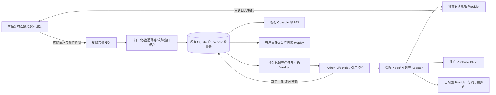

# 故障智巡 v0.3.0 升级设计

审计日期：2026-10-02（Asia/Shanghai），审查补记 2026-10-03。第 1—10 节保留第 1 步设计基线；其中阶段状态为当时快照。第 11—16 节记录第 2—7 步实施与设计差异，第 17 节记录第 8 步发布准备。第 9 步现已授权，发布记录见第 18 节。配套记录见[升级进度](v0.3.0-progress.md)、[第 7 步实际验收](v0.3.0-validation.md)及[第 8 步审查](v0.3.0-review.md)。

## 1. 授权范围与当前基线

- 本轮只读审计源码和公开参考资料，只新增本文件及进度文档；不改业务代码、Fixture、测试、依赖、配置或历史交接文件，不启动服务。
- 实际仓库：`D:\agent应用开发求职\线上服务故障排查与处置agent\miniclaw-main`；外层目录不是 Git 仓库。
- 分支 `main`；HEAD `04fa5f02de1ba49ed1853e723fcc19a87f033a07`；审计开始时 `git status --porcelain=v1 --untracked-files=all` 为空，无用户未提交修改。
- 仓库内（排除依赖及 Git 数据）与已检查的外层、`D:\agent应用开发求职`、`D:\` 均未发现 `AGENTS.md`。后续步骤仍须复查。
- Console 产品版本写在 `web/src/features/incident-console/AuthLayout.tsx:128`、`ConsoleLayout.tsx:281`，均为 `v0.2.0`。根包、Runner、Electron 为 `1.0.0`，Web 包为 `0.0.1`，不是产品 Release 版本。
- 本地标签为 `v0.1.0`、`v0.2.0`。本轮匿名 GitHub API 查询的远端标签和已发布 Release 也是这两个；`v0.2.0` 指向 `8049fb0b662f56645644b5404016454976b688c2`，当前 HEAD 在其后。未发现同名 `v0.3.0`；这只是本次快照，第 8、9 步重新核验，不能覆盖同名发布。
- 当前 HEAD 的 [CI 运行](https://github.com/ydflow/incident-response-agent/actions/runs/36548657772) 为 `completed/success`；不是本轮重新运行的 CI，也不是 v0.3.0 的验收。
- 外层 `PROJECT_STATE.md` 是 **2026-09-27 历史交接记录**：其中 feature 分支、`c89de7c` 和大量未提交修改的描述已过时。本文件和进度文档明确其历史性，原文件保持原样。
- [LICENSE](../LICENSE)、[NOTICE](../NOTICE)、[能力归属](project-ownership.md) 保留：MiniClaw 宿主/Web、Pi Runtime、Provider、Session、通用 Tool Calling 属于导入基础；Incident 业务增量不等于从零开发上述能力。

只检查数据库/Provider 的代码与存储机制，没有读取运行数据库、个人模型配置、凭据或原始运行日志；本轮不能据此判断当前模型是否可调用。

## 2. 现有实现与接入限制

### 2.1 告警入口及调用链

现有 Incident 入口是指定 Fixture 案例的脚本/测试，不是监控 Webhook。通用 IM 渠道中的 Webhook 不构成 Incident 告警接入。Console 读取案例与历史产物，没有自动创建调查任务的入口。

```text
确定性验收：
incident_agent/tests/test_workflow_acceptance.py
  → InvestigationWorkflow(注入 EvidenceGateway 与 ScriptedEvidencePlanner)
  → Node workflow_tool_harness.ts
  → createMcpTools → Pi Tool Adapter → 四个受 SAFE Gate 包装的查询
  → Fixture → Evidence + AgentEvent → Python 校验 → Diagnosis / Escalation

现有真实模型 Demo：
python -m incident_agent.demo_live INC-001|INC-011|INC-012
  → Python IncidentLifecycle、独立 run 目录、初始状态事件
  → scripts/demo-incident-live.ts
  → 已配置启用的 Provider → PiRuntimeAdapter.createSession / session.prompt
  → 受限工具 → Fixture → Gate Evidence Collector / JSONL
  → Node 结构化决定与引用校验 → Python 状态收敛 / run.json

常规 MiniClaw 执行：
宿主 → container/agent-runner/src/pi-index.ts
  → 现有 Provider / Pi Session / MCP Tools / 通用 StreamEvent
  → Incident 工具作为其中的一组扩展
```

Python `workflow.py` 注入网关和 planner，核验 Evidence 归属、唯一性、与 `EvidenceCollected` 的顺序对应，以及 Diagnosis 的引用子集；它不启动 Pi、查询网络或执行处置。真实 Demo 并非调用这个 Workflow 的线上服务，而是另一条由 Python Lifecycle 包装 Node/Pi 的脚本链。`pi-index.ts` 负责通用运行；不能把通用对话或 `session.prompt` 宣称为现成的持久化 Incident Worker。

现有 Node Demo 使用隔离临时 cwd，只允许四个取证和三个模拟处置工具；Python 子进程超时 240 秒、Node 回合中止时间 180 秒。**一次 `session.prompt` 可以包含多次模型请求**，现有 Demo 没有逐请求硬调用计数，不把文档中的“一回合”解释为一次模型 HTTP 调用。

### 2.2 Fixture、模型、证据

- `incident_agent/models.py` 的 Incident/Evidence/Diagnosis 均 `extra="forbid"`。Incident 只有 `incident_id/service/alert/started_at`，ID 本身仅要求非空；严格案例 ID 的限制位于 Fixture 工具，不在整个领域模型。
- `incident-evidence-tools.ts` 的参数和 `loadIncidentFixture` 均要求 `^INC-\d{3}$`。Loader 固定读 `incident.json/logs.json/metrics.json/trace.json/git_diff.patch` 五文件，拒绝目录越界、符号链接、ID/服务错配、无效 JSON、答案字段、无效时间/指标及不一致 Trace 时长。每个查询都会经过整组 Fixture 校验。
- `query_logs/query_metrics/query_trace/query_git_diff` 分别返回六字段 Evidence；内容是日志条目、指标样本、Trace 数组或 patch。时间分别来自最后日志、最后指标、所选 Trace span/告警时间、patch 日期。空 Trace 数组是允许的成功结果；不能改成失败以迁就新设计。
- Fixture Evidence ID 为 `${incidentId}:${source}`；内存收集器按 ID 存入 Map，同一来源重复采集会覆盖内存值。现场查询需要独立 ID，不修改这些历史 ID 或原测试语义。
- `withIncidentToolEvents` 记录真实 `ToolCalled → ToolResult → EvidenceCollected`，错误/超时另有 `ToolFailed`，截止时间为 5 秒，向 handler 传 AbortSignal。错误返回不成为 Evidence；此前成功证据仍保留。

### 2.3 状态、审批、Replay

现有状态表保持：

```text
RECEIVED → INVESTIGATING | FAILED
INVESTIGATING → DIAGNOSED | ESCALATED | FAILED
DIAGNOSED → AWAITING_APPROVAL | ESCALATED | FAILED
AWAITING_APPROVAL → RESOLVED | ESCALATED | FAILED
RESOLVED / ESCALATED / FAILED 无后继
```

`IncidentApprovalGate` 的固定白名单是四个取证 SAFE、三个模拟处置 ASK、删除探针与未知动作 BLOCK；策略读取/审批存储失败或请求不一致均阻断。审批记录状态不是 Python Lifecycle 状态，不能将前者的 `AWAITING_APPROVAL` 字符串当作已经合法推进后者。

Gate 只在可信宿主调用 `allow/reject` 后进入纯模拟 Executor。Console 决定经管理员 API、签名宿主桥接、Runner 实例/组范围、请求 ID 和 10 秒控制命令时效校验；浏览器不指定动作参数。Gate 的 pending 在进程内，重启即失效，没有从历史 JSONL 恢复执行授权。**控制命令的 10 秒时效不等于审批对象已有独立 TTL**；v0.3.0 需要在 Incident 接入层增加审批对象的期限/运行绑定。

Python/TS 的 AgentEvent 共享十种事件，顶层严格、payload 为 JSON 字典。Python `extend` 导入生产者已记录的事件，不重复写 JSONL。Replay 检查事件 ID、时间顺序、合法状态、ToolCall/结果、证据与诊断引用、审批决定及拒绝后执行；它仅重建历史，不调用模型、工具或 Executor。JSONL 文件名允许字母/数字/下划线/连字符，因此独立 LIVE ID 可兼容；Fixture 限制无需放宽。

Replay 当前不是通用语义证明：部分时序问题是 warning，ActionExecuted 主要核对批准 ID，不能声称已验证所有参数/期限/事实真伪。现场引用范围和运行绑定必须由新 Adapter 严格验证，不通过绕过现有 Replay 解决问题。

### 2.4 数据库、鉴权、Console

- 后端 TypeScript + Hono；前端现有 React 19/Vite/组件体系；Python 为 Incident 校验和回放。
- `src/db.ts` 使用 `sqlite-compat.ts`（Node 为 better-sqlite3），**源码目标 schema 69**；`data/db/messages.db` 是默认路径，不代表本轮已读取其实际 schema。初始化含升级前备份门、busy_timeout、WAL、外键和事务。
- 已有 `task_runs` 的部分唯一索引、领取/通知租约等通用任务机制，以及 memory-store 的 SQLite FTS5；可参考事务/模块绑定方式，但不把 Incident 改造成通用 scheduled task，也不把 Runbook 混入个人 Workspace Memory。
- 认证为 bcrypt 密码、数据库 Session、HMAC 签名 HttpOnly/SameSite Cookie、用户状态和权限检查。当前没有 Incident 专用机器接入令牌；新增的是狭窄入口适配，不改全局认证协议。
- `/api/incident-console` 复用登录鉴权；成员仅可读 Fixture 目录，管理员可读未带租户归属的历史。`/traces`、`/evaluation`、`/approvals` 和审批决定均管理员限制。
- Console 现有历史读取器受固定目录、符号链接、文件大小/数量/事件数和脱敏限制；它是展示投影，会跳过坏行，**不是完整 Replay 校验器**。新链路必须另有严格回放状态，不能将“显示了时间线”当作回放通过。
- 旧评测展示 `src/incident-console-evaluation.ts` 确实读取独立答案及案例矩阵，限管理员的人类展示。它不得被新 Agent API、工具或检索调用；新 Agent 白名单必须与这一路由隔离。
- 页面版本硬编码分散在两处；第 8 步集中到 Console 产品版本模块，更新为 v0.3.0。保留上游包名、包版本及 imports，不机械修改全部 package.json。

## 3. EvoHarnessAlert 阅读结论

公开参考提交：`2dfbdfcda44814078c37a82b4a34d3b819b927ba`，2026-10-02 通过 GitHub commits/main 和 recursive tree 核验，然后逐文件读取固定 SHA 的 raw 内容。GitHub 页面读取曾超时，固定 SHA 的 raw 读取成功。以下结论是源码阅读，没有运行该项目或验收其生产效果。

| 文件                                                                                                                                     | 已观察到的实现                                                                                   | 占位/缺口及本项目决策                                                                                                                                                                                                |
| ---------------------------------------------------------------------------------------------------------------------------------------- | ------------------------------------------------------------------------------------------------ | -------------------------------------------------------------------------------------------------------------------------------------------------------------------------------------------------------------------- |
| [alerting.py](https://github.com/adandd-byte/EvoHarnessAlert/blob/2dfbdfcda44814078c37a82b4a34d3b819b927ba/app/services/alerting.py)     | Webhook/Alertmanager item 归一、数据库告警/Incident 写入、任务入队；可选模型摘要，失败转规则结果 | 未知级别默认 P2；聚合键为类型/服务/指纹，没有显式环境/时间窗口；恢复告警会直接解决 Incident。轨迹中部分“完成”步骤由模板生成，知识条目多为告警文本/labels/annotations，不证明真实日志检索。只借鉴输入映射和职责拆分。 |
| [knowledge.py](https://github.com/adandd-byte/EvoHarnessAlert/blob/2dfbdfcda44814078c37a82b4a34d3b819b927ba/app/services/knowledge.py)   | 数据库分块、实际 Python BM25、可选 Chroma 召回、权重融合、本地词法重排、相邻块展开和向量故障降级 | 不是 Elasticsearch 或外部模型重排；分块为压缩空白后的滑窗，检索读取全量分块，缺逐服务/环境前过滤和不可变版本引用合同。本项目独立实现小规模 Markdown/BM25，不采用其数据库/向量基础设施。                              |
| [tool_queue.py](https://github.com/adandd-byte/EvoHarnessAlert/blob/2dfbdfcda44814078c37a82b4a34d3b819b927ba/app/services/tool_queue.py) | MySQL 扫描、台账/通知线程池、进程内限流、重试、死信、启动恢复 RUNNING                            | 扫描后逐条写 RUNNING，不是带 token 的原子 Claim；无多 Worker fencing。源码重试延迟是按 attempts 线性递增，不能因注释称为指数退避。队列主要执行台账/通知，不是本项目调查任务；不启用外部通知。                        |
| [coordinator.py](https://github.com/adandd-byte/EvoHarnessAlert/blob/2dfbdfcda44814078c37a82b4a34d3b819b927ba/app/agents/coordinator.py) | 进程内任务/成果/事件、轮数和认领预算、候选与审查产物关联                                         | `_act` 明确为规则占位：上下文召回为空、回复为固定提示、审查为固定 approved/confidence。不是已接真实模型的专家调查，也不是可信宿主的人审权限。本项目不引入多 Agent/黑板重构。                                         |
| [spec-code-map.md](https://github.com/adandd-byte/EvoHarnessAlert/blob/2dfbdfcda44814078c37a82b4a34d3b819b927ba/docs/spec-code-map.md)   | 对规格与代码做差距说明                                                                           | 明确 Webhook/Chat 未统一；租约/持久化检查点、真实专家数据源、权限前过滤、生产容量和自进化闭环仍未完成。图是目标架构，测试数字不转用为本项目成果。                                                                    |

GitHub API 的 license 元数据为空、该提交 tree 未发现 LICENSE 文件。这里只阅读和设计学习，不复制源码/手册、不整仓移植、不把其设想标为本项目实现。MiniClaw 的许可证与 NOTICE 原样保留。

## 4. v0.3.0 最小完整链路与模块



建议新增路径（均未创建，实施时可保持职责并小幅调整名称）：

```text
src/incident-alert-types.ts              输入 DTO、AlertEnvelope 与 LIVE ID
src/incident-alert-ingest.ts             归一/幂等/聚合，不调用模型
src/incident-ingest-auth.ts              狭窄机器认证与现有账户权限衔接
src/incident-store.ts                    绑定现有 SQLite、迁移及事务
src/routes/incident-alerts.ts            Webhook/Alertmanager/告警查询
container/agent-runner/src/incident-source-provider.ts
container/agent-runner/src/incident-live-evidence-tools.ts
container/agent-runner/src/incident-investigation-tools.ts
container/agent-runner/src/incident-runbook-search.ts
container/agent-runner/src/incident-live-approval-context.ts
runbooks/                               唯一允许索引的通用 Markdown 手册
src/incident-investigation-worker.ts     Incident 专用任务，不改通用 Scheduler
src/incident-model-budget.ts             仅调查请求的传输预算 Adapter
incident_agent/live_investigation.py     复用模型、Lifecycle、引用校验
scripts/incident-investigation-runner.ts 现有 Pi Adapter 的专用受限会话
scripts/demo-pool-service.ts             真实请求/资源槽/实时日志与指标
scripts/accept-v030-stepN.ts             分步验收入口，N=2..7
web/src/features/incident-console/       在现有页面/模型上加数据展示
```

宿主 Node 是数据库唯一写入者；Worker 领取任务后启动本任务专属 Python/Node 子进程。Python 管 Lifecycle，Node 管 Pi/工具；通过有界 NDJSON 协议逐步返回事件、Evidence、查询结果和知识引用，宿主验明 Incident/run/lease 后持久化。凭据仅在可信进程内传递，不进 NDJSON、Agent Prompt 或结果文件。只向当前子进程发取消，不按端口/名称结束未知进程。

与旧链路的兼容方式：Fixture 默认工具工厂、原五文件、测试 harness、旧 Demo 和通用 `createMcpTools` 不变；新调查工厂独立组装现场工具，复用 Gate、工具事件包装和 Pi Tool Adapter。同名 `query_*` 在不同受限会话选择不同 Provider，不让 Agent 决定文件路径或 URL。唯一必要改动是 Incident 专用接入点、SAFE 明确注册及可选事件元数据；不改 Pi Runtime/Provider/Session/通用 Tool Calling 实现。

## 5. 数据与 ID 合同

### 5.1 LIVE ID 与 strict Fixture ID

- Fixture 继续 `INC-001..INC-012`，Loader 和原参数仍严格 `^INC-\d{3}$`。
- 现场 Incident 由宿主生成 `LIVE-<UUID>`，严格校验 UUID 形状和长度，独立数据库命名空间；外部 external_id 不能当内部 ID。LIVE ID 只作键，不推导文件/网络地址。
- Python Incident 非空 ID 已可承载 LIVE ID；旧事件和 JSONL 文件名合同也可承载，不需扩充基础模型或放宽路径校验。
- 宿主 Registry 以 LIVE ID 查出被授权的 service/environment/source_id；缺失返回 not_found，不退回 Fixture。旧 Console Fixture catalog 保持；新现场记录通过 DB 投影追加。

### 5.2 AlertEnvelope

告警元数据留在独立 DTO/表；交给 Incident 的仍然只有四字段。

```text
AlertEnvelope = {
  incident: Incident { incident_id, service, alert, started_at },
  metadata: {
    source, external_id, environment, severity, severity_raw,
    severity_mapping_status, alert_type, fingerprint, starts_at, ends_at,
    status, delivery_key, occurrence_key, aggregation_key,
    source_summary, received_at, schema_version
  }
}
```

Envelope 自身也是严格 Schema；来源摘要限白名单、大小并脱敏。源凭据中的 service/environment scope 优先，输入不允许越权改 scope。禁止把 metadata 展平进 Incident/Evidence/Diagnosis，禁止将 `extra=forbid` 改成 allow/ignore。告警文字仅是待验证信号，annotations 内的“根因”和“建议”不自动变成事实。

已知级别明确映射：P0-P3/sev0-sev3；critical/fatal/high→P1，warning/warn/medium→P2，info/low→P3，emergency/blocker→P0。未知保留原值并 `severity=null/mapping_status=unknown`，要求人工确认，排序不静默放到最低。P0-P3 是调查优先级，不决定 SAFE/ASK/BLOCK。未知类型保留 UNKNOWN 与原值，非法 status 拒绝；starts_at 必须带时区，归一 UTC，ends_at 的零值/缺失和真实恢复时间分别处理。

### 5.3 接入、幂等及故障窗口

拟定 `POST /api/incident-alerts/webhook` 和 `/alertmanager`，`GET /api/incident-alerts` 与 `/incidents/:id`。鉴权先于解析/持久化，拒绝未授权、过大输入和越权 scope。接入事务成功才返回 2xx，数据库暂不可用返回安全 503。

接入复用现有 Cookie Session、账户状态/权限，新增 `ingest_alerts`，普通成员不默认获得；读取现场数据初期管理员或明确被授权的 source scope。机器入口用狭窄 Bearer Adapter（仅此路由），随机高熵令牌的 hash 绑定现有 active 用户、source、service/environment scope、有效期/撤销状态；每次还查账户权限。令牌不能登录或调用配置/审批/管理 API。创建、撤销属于可信管理员/本地初始化工具，明文仅本地一次取得，不进入 Git/报告/Agent。原全局 authMiddleware 不放宽。

协议合同依据 [Alertmanager Webhook 配置](https://prometheus.io/docs/alerting/latest/configuration/#webhook_config) 和 [通知结构](https://prometheus.io/docs/alerting/latest/notifications/)：逐个 alerts 的 labels/annotations/status/startsAt/endsAt/fingerprint 归一，不把 groupKey 当内部 Incident ID，不以 batch status 覆盖 item status。version/group 信息只作受限元数据；truncatedAlerts 大于零标明输入不完整，不能推断未收到的告警已恢复。generatorURL/externalURL 仅脱敏显示，不抓取 URL。初始限制 256 KiB、50 alerts、64 个 label/annotation、单摘要 2 KiB；批次先全量校验，原子落库。

三个键分开：

1. **投递键**：source credential scope + 显式 Idempotency-Key（批次还含稳定 item 身份）；未提供时对规范化 item 的身份、状态和有效变化内容做 SHA-256。相同键不同正文返回 409；相同正文返回原接收结果，不重复计数或建任务。
2. **告警发生键**：source scope + service + environment + fingerprint + starts_at + external_id（无外部 ID 用稳定指纹）。重复通知可更新同一 occurrence；恢复通知仍绑定原 starts_at 的 occurrence，不能因为 ends_at 跨窗而另建故障。
3. **聚合键**：source scope + service + environment + fingerprint + episode。默认窗口为首个 firing starts_at 起 **15 分钟半开区间**；不随新投递无限延长。新 occurrence 仅归入未关闭且包含其 starts_at 的 episode；窗外或已确认恢复后新 starts_at 的 firing 创建新 episode。不同 fingerprint 不做未经验证的智能合并。

在 SQLite `BEGIN IMMEDIATE`/事务内检查投递唯一键、发生唯一键、查询/创建 episode、关联、更新计数。episode 号和聚合键有 UNIQUE，不用先读后写的进程锁替代数据库约束。迟到更新先找 occurrence 归属，不能复活已关闭 episode；超过允许迟到范围（建议 1 小时）的全新旧 occurrence 标记 late/人工处理，不并入当前窗口。并发、跨环境、窗口边界、恢复后再触发均要测试。

告警恢复更新 occurrence 状态与 aggregation_closed_at；**不写调查 Lifecycle 的 RESOLVED**。Incident 展示的 alert_count 是不同 occurrence 数，delivery_count 是不同投递数，重复请求数量另记，避免把重发当多条故障证据。

### 5.4 数据库增量与迁移

按步骤增量，表名前缀独立；字段/索引为设计合同，不在第 1 步执行 SQL。

| 步骤 | 拟新增表                        | 关键数据/约束                                                                                                           |
| ---- | ------------------------------- | ----------------------------------------------------------------------------------------------------------------------- |
| 2    | incident_ingest_credentials     | token_hash UNIQUE、owner_user_id、source/scope、expires/revoked；无明文凭据                                             |
| 2    | incident_live_records           | LIVE ID PK、四字段 Incident、scope/环境、聚合 base+episode UNIQUE、窗口/首末时间、告警概况                              |
| 2    | incident_alert_occurrences      | occurrence_key UNIQUE、Incident FK、规范化状态/级别及原值、starts/ends、脱敏摘要                                        |
| 2    | incident_alert_deliveries       | delivery_key UNIQUE、canonical_hash、occurrence/Incident FK、收到时间和原返回引用；无原始 payload                       |
| 4    | incident_runbook_chunks         | doc_id/version_hash/section/chunk_index UNIQUE、内容/范围/validity、BM25 tokens；历史版本不覆盖                         |
| 5    | incident_investigation_jobs     | generation/idempotency UNIQUE、Incident FK、排队/运行/重试/终态、attempt/next_at、lease owner/token/expiry、budget 累计 |
| 5    | incident_investigation_runs     | run_id PK、job/attempt UNIQUE、当前合法 Lifecycle 投影、版本快照、错误/结论摘要、审批绑定信息                           |
| 5    | incident_run_events             | event_id UNIQUE、run_id+seq UNIQUE、原五字段 AgentEvent、类型/时间/归属校验                                             |
| 5    | incident_run_observations       | query_id UNIQUE、run/工具/时间/scope/结果状态、可选唯一 evidence_id 与六字段 Evidence；失败没有 Evidence                |
| 5    | incident_run_knowledge_refs     | reference_id UNIQUE、run/tool_call/query、doc/chunk/hash/原文快照/适用范围，与观测分离                                  |
| 7    | incident_recovery_verifications | 验证 ID、run、人工演示动作记录、前后观测 ID/窗口/阈值/result；独立于模拟执行和 Lifecycle                                |

`incident-store.ts` 采用已有 bindDatabase/createSchema 模式绑定宿主现有连接；`src/db.ts` 只增加必要初始化/关闭绑定和下一 schema 迁移。69 是当前源码版本，后续每步基于届时版本递增，不预约重复的版本号。新 schema 首建和旧库迁移都注册；复用原升级前备份门，不绕过失败，也不重写旧表。旧运行文件不灌成 LIVE 数据，旧 Fixture 不入新现场表。

验收使用临时独立 SQLite：mock/inject DATA_DIR/STORE_DIR（现有测试已这样做），新脚本要求明确测试数据根。现 `config.ts` 的 DATA_DIR 是 cwd/data，**不存在可直接假设的通用 MINICLAW_DATA_DIR 开关**；第 2 步应加 Incident 演示专用显式路径注入/独立 cwd 装配，拒绝误用现有运行库。不启动原主入口来冒充隔离验收，以免初始化个人库或 IM 渠道。

## 6. 只读现场 Provider 与 Runbook

### 6.1 Provider 合同

Fixture 行为原样包装为默认 Fixture 路径；现场使用独立 LocalDemoProvider。注册表由宿主绑定 source_id→固定 loopback 服务地址、路径和 scope；Agent 只提交内部 Incident ID、受限时间窗口/limit。禁止任意 URL/路径、重定向、网络探测和源配置工具。

初始边界：查询窗口最多 15 分钟，默认围绕故障时间且不读未来；最多 200 日志或指标样本；单响应 64 KiB、单调查累计 256 KiB；截止 5 秒并传取消信号。宿主检查 Incident/source/service/environment、观测时间和 query_id，重复采集使用 `${LIVE_ID}:${run_id}:${source}:${query_uuid}`，只追加，不覆盖历史证据。

| 查询状态                      | 是否 Evidence                 | 工具事件与界面解释                                                                  |
| ----------------------------- | ----------------------------- | ----------------------------------------------------------------------------------- |
| success                       | 是，真实观测                  | ToolResult returned → EvidenceCollected；展示来源/观测时间/查询窗/条数              |
| empty                         | 是，内容为有范围的空结果 JSON | ToolResult returned → EvidenceCollected；只证明这次查询未返回数据，不证明故障不存在 |
| unsupported                   | 否                            | isError + ToolFailed，Trace/Git 未实现明确呈现                                      |
| unavailable                   | 否                            | 源未配置、离线或拒绝访问；不是空数据                                                |
| timeout/cancelled             | 否                            | ToolFailed 并保留此前证据；禁止响应晚到后再次落证据                                 |
| invalid_response/scope_denied | 否                            | 数据校验或权限失败；失败收敛，不回退 Fixture                                        |

现场工具仍返回可通过旧六字段 Evidence 校验的对象：`content` 为有界 JSON，含 query_id、provider/source_id、service/environment、window、observed_at、status、items/truncated；其他 provenance 存在 observation sidecar 中，不加未知顶层字段。timestamp 与查询观测时间一致，correlation_id 关联查询/请求，日志记录内仍保留 request_id。来源文字不能伪造为真实生产。

新工具工厂选择现场 Provider，并保持 `Gate.runSafe → withIncidentToolEvents` 包装；Trace/Git 有明确失败结果，不能开放通用 shell/file/network 工具“补齐”。旧 Fixture 时间/ID/空 Trace 的验收不变。

### 6.2 本地连接池演示

复现已有连接池饱和症状，独立 Node 演示服务绑定 `127.0.0.1` 的任务专用端口（建议 43210；占用则选择空闲端口，不结束占用者）。真实 HTTP 请求需获取有限资源槽；通过 CLI/可信宿主控制 capacity、hold_ms、acquire_timeout_ms，模拟配置缩小/慢持有产生等待、获取超时及请求失败。它不是生产数据库。

每次实际请求记录脱敏 request_id、时间、槽位等待/获取结果；实时记录 pool_capacity/active/waiting/acquire_latency/request_success/error。有限环形缓冲与查询上限，避免无限日志。load driver 有并发/请求总数/运行时限，不无限压测。

只有日志和指标时，现场结论可以支持“资源槽饱和、获取超时”的观测及根因假设；没有实际变更源/Trace 时，不能照搬 Fixture 的配置变更答案或断言谁修改了配置。若因果证据不足，升级人工并列补证据要求也是完整链路的合法结果，不要求固定诊断来凑成功。

独立阈值检测器从实际指标计算：例如连续两次 5 秒采样 waiting>0 且获取超时率>10% 触发；连续三次 waiting=0 且成功率≥99% 发恢复信号。检测器经受限入口投递，以稳定 fingerprint 和本次 episode starts_at 保持幂等；这是本地规则告警，不声称已连接实际 Alertmanager。CLI 控制恢复不注册为 Agent 工具，第 7 步重查指标形成真实恢复验证。

### 6.3 Runbook 与答案隔离

独立 `runbooks/` 只允许管理员显式列入 manifest 的 Markdown；不得扫描仓库根、docs、测试、evaluation、个人 memory 或 Agent cwd。双重拒绝受保护路径、符号链接/realpath 越界、答案字段及按 INC 案例 ID 映射的知识。升级设计文档本身也不进入检索。

第 4 步提供连接池耗尽、依赖超时、发布异常、磁盘不足、任务堆积通用手册：症状、补证据查询、处置前提/风险、恢复指标。独立编写，禁止据 expected_cases/案例矩阵反推手册或从 EvoHarnessAlert 复制。

按 Markdown 标题/段落切片，建议每块≤1000 字、跨长段≤120 字重叠，保留 doc_id、章节、版本内容 SHA-256、服务/环境适用范围、valid_from/valid_until、原文字符位置与片段。分词采用英文/数字/下划线与中文单字/双字，明确词法限制；BM25 在权限/服务/环境/有效期过滤后的候选上打分，默认 Top-3，上限 Top-5，平分用稳定 ID 排序。无命中返回空，检索故障返回错误，不混淆。

`search_runbooks` 新增为明确 SAFE 注册项，参数限 Incident ID/query/top_k；未知工具仍 BLOCK。它记录 ToolCalled/ToolResult，`collectsEvidence=false`，不产生 EvidenceCollected。KnowledgeReference 是独立 strict DTO：reference_id、incident_id/run_id/tool_call_id/query、doc_id/section/version_hash、适用范围、原文片段/位置、rank/score/retrieved_at。

手册不属于 Diagnosis.evidence_ids；扩展的 InvestigationReport 包装旧 Diagnosis，另有 knowledge_reference_ids、facts（观测 ID）、hypotheses、limitations、next_evidence_requests。引用存在/归属/窗口/服务/类型验证是结构与范围检查，不宣称证明自然语言因果。检索快照随 run 持久化，修改手册后回放仍用旧快照，不重新检索。

## 7. 持久化任务、模型预算、事件及审批

### 7.1 调查任务

第 2 步只接收与查询告警，不建自动模型调查。第 5 步才接任务：聚合 Incident+generation 的唯一幂等键；同一 Incident 的 queued/running/retry_wait 设部分唯一索引。同窗口新增告警在排队时合并；开始运行时冻结输入版本，新增内容标记 pending_update，不偷改此次 Prompt。终态默认不因重复告警自动再调用模型；明确人工重查或新故障 episode 才产生下一 generation。

原子领取在短 SQLite 写事务中查询 due job 并条件 UPDATE，递增 lease_token；默认租约 30 秒、心跳 10 秒。每一次事件/观测/结论/状态写入均在事务内核对 owner、token、有效期；失效 Worker 不得提交、心跳、批准或续用旧 run 的结果。两个 Worker 并发必须只有一个成功 claimant，不只做进程内 mutex。

最多 2 次 attempt，暂时性错误延后 10 秒再试；任务等待凭据记 `blocked/no_configured_model`，无自动轮询模型请求。无效模型输出、引用越界、冲突/不足、预算耗尽不无限重试；按明确原因进入人工升级或失败。模型已发出的请求也计入 generation 总预算，重启/重试不能重置。

旧 attempt 在租约失效时保存中断原因；可合法 FAILED 的活动 Lifecycle 才记录该转换，否则保持终态。新 attempt 有独立 run_id 和新的 RECEIVED Lifecycle，是新的调查运行，不将原 FAILED/ESCALATED/RESOLVED 生命周期重置。历史 run 永久保留，界面标明“本次运行状态”，不把最新投影冒充旧状态被修改。

### 7.2 调用预算及可实现性

建议初值：每 run 墙钟 180 秒、工具最多 8 次（含失败）、检索最多 2 次、**实际 Provider 上游请求最多 6 次**；每 generation 最多 12 次 Provider 请求、最多 2 个 attempt。真实模型 E2E 第 7 步最多 3 个 run 且最多 18 次上游请求，计数器跨重启持久化，验收不得靠反复运行刷成功。

源码审计发现 `RuntimeSessionOptions` 没有 maxTurns/maxRequests，RuntimeEvent 也没有逐 HTTP 请求通知。已安装 Pi SDK 有 `before_provider_request` extension hook，但 handler 抛错会被 SDK 捕获后继续，因此**不能用抛异常的 hook 充当硬预算门**。

设计采用仅调查会话启用的薄传输预算 Adapter：由可信宿主给它固定的已配置 Provider 目标，运行在本任务的 loopback 地址；Pi 会话经这个 Adapter 访问同一个已配置模型。上游发送前原子预留 request quota，所有重试/后续回合都计数；配额耗尽返回固定错误，绝不转发。它不是新模型 Provider/框架，不改 Provider 配置或 Runtime；URL/凭据对 Agent 不可见，禁止任意目标/重定向，生命周期随本任务关闭。

第 5 步必须验证所选现有 Provider 的实际协议路径及 stream/cancel 兼容；只支持经验证的配置类型，不泛化所有 Provider。必要时在会话专用 extension 中设置有限输出参数、禁用自动 compact，工具门同步计数，墙钟到期调用 session.abort 并关闭自身子进程。输入/输出字节上限和实际 token usage 单独记录；不把事后 usage 统计说成预先硬 token/费用上限。传输预算未通过验收时不进行真实模型调用，记录具体缺口，确定性验收可继续。

### 7.3 事件持久化与只读回放

保留十种 AgentEvent 及顶层五字段；查询范围/结果、知识引用、预算原因等放在既有 payload 可选 JSON 或独立 sidecar。`search_runbooks` 不产生观察证据事件。无实际 ToolCall 就不编造 ToolFailed；模型/任务控制错误记 run error 或合法 StatusChanged。诊断仍须此前已收集观测证据。

宿主按 run 分配连续 seq，事件及关联 observation/reference 在同一 SQLite 事务提交；事件 UUID 唯一，重发协议包返回已有提交，不重复追加。生产者事件时间与观测数据时间分开；保留事件产生顺序，逆序时间拒绝/报告，不能排序修复伪造轨迹。

DB 是新现场运行的权威记录。JSONL 由 DB 已提交事件顺序导出到测试/任务私有目录，通过临时文件与原子 rename 发布；不让多个进程同时写现场文件。DB 提交后导出失败可重导，不丢事件或重复行。Python/Node NDJSON 是执行传输协议，不是对外原始日志。旧 Demo 的双生产者 JSONL 流程保持原样。

新 Replay Adapter 先严格读取 DB/受控导出、验证引用 sidecar 和 seq/归属，再调用现有 Python `load_events/reconstruct_runs`。保存知识原文快照；已丢失快照返回回放不完整。API 接收 run_id 而非用户文件路径；限读大小，拒绝链接。不得加载模型配置、恢复任务、重跑工具/检索或重建审批权限。Console 新时间线标注 replay_validated/warnings，不以宽松展示器跳过损坏记录后声称通过。

### 7.4 审批及恢复边界

原 SAFE/ASK/BLOCK 与签名桥接保留。新接入层冻结具体动作、target、参数、Incident、run、服务/环境及 request_hash，审批有效期建议 10 分钟；期限和 lease/runner_instance 的检查在可信执行入口完成，审批决定不接受浏览器重新指定参数。优先用 Incident 专用 context 包装/可选宿主校验接入，不能在页面模拟授权。原历史审批不改为新授权。

新自动调查默认只读，完整调查链路不以提出处置为成功条件；旧模拟处置和历史审批照常保留。若现场会话开放模拟请求，只能展示其模拟性质，Gate 和 live context 同时校验。pending 绑定活跃 Gate；子进程退出即标记失效，查询历史 pending 不作为可批准记录，重启不自动重建 pending 或批准。第 5 步若接现场审批，应注册新的专属 Runner 实例到原签名桥接，并验证失效/参数变更/无审批均不调用 Executor。

第 7 步的恢复由可信操作者仅改变本任务演示配置，再只读查询恢复指标，写 RecoveryVerification：动作记录、前后 Evidence、阈值/窗口、通过或未达标。**健康恢复与 Incident RESOLVED 分开**：当前状态表禁止 DIAGNOSED→RESOLVED，不能为了展示成功制造审批或绕过表。未走合法处置状态链时仍保留 DIAGNOSED/ESCALATED，并展示“演示服务恢复已验证”；若未来需要新的解决语义，须单独设计并兼容历史测试，不在本版暗加状态捷径。

## 8. 阶段依赖与可操作验收

第 1 步结束停止；下列命令是后续步骤的验收约定，新路径/脚本实施时才创建。不存在的测试入口不算已验收。每步更新进度，列命令、退出码、数量、失败与未运行项；不删/跳过/弱化原测试。

所有 PowerShell 命令在已核验实际仓库运行。新验收脚本必须强制使用独立临时数据库与任务资源，默认不调用模型、不连接外网；真实模型需要显式受预算参数且不接收明文凭据 CLI 参数。

| 步骤 | 依赖及交付                                  | 验收入口与必须覆盖的行为                                                                                                                                                                                                                                                                                                                                                                                                                                                                                   |
| ---- | ------------------------------------------- | ---------------------------------------------------------------------------------------------------------------------------------------------------------------------------------------------------------------------------------------------------------------------------------------------------------------------------------------------------------------------------------------------------------------------------------------------------------------------------------------------------------- |
| 1    | 当前源码/参考阅读，新增设计与进度           | `py -3.13 -B -m pytest incident_agent/tests --collect-only -q -p no:cacheprovider`；同命令加 `-m core`；`npm run docs:check`；显式两文件 Prettier 与未跟踪文件 diff 检查。仅收集，不执行产品测试。                                                                                                                                                                                                                                                                                                         |
| 2    | 1；输入、认证、独立测试 DB 的增量迁移与聚合 | `npm exec -- vitest run tests/incident-alert-ingest.test.ts tests/incident-alert-store.test.ts tests/incident-ingest-auth.test.ts tests/db-upgrade-safety.test.ts`；`node --import tsx scripts/accept-v030-step2.ts`。同投递幂等/键冲突、批次非法输入、401/403、并发不重建、跨环境/跨窗/恢复后新故障不混并；结束独立进程后重开库仍可查询。提供本地 PowerShell POST/查询示例，不称为真实 Alertmanager 联调。                                                                                                |
| 3    | 1、2；演示服务、现场工具工厂                | `npm exec -- vitest run tests/incident-live-evidence-tools.test.ts tests/incident-evidence-tools.test.ts tests/incident-agent-events.test.ts`；`node --import tsx scripts/accept-v030-step3.ts`。脚本只启动/结束自身 demo-pool-service，有限实际负载→实时 logs/metrics；同源两次 ID 不覆盖、source/scope/时间限制、取消/timeout/empty/unavailable/unsupported 明确区分；旧 Fixture 无差异。                                                                                                                |
| 4    | 1；最终接入依赖 3，检索可独立测试           | `npm exec -- vitest run tests/incident-runbook-search.test.ts tests/incident-approval-gate.test.ts`；`node --import tsx scripts/accept-v030-step4.ts`。独立人工标注 queries，不从 expectedDocs/expectedTerms 生成库；Top-3 命中率和排名按实际报告，含无匹配、错服务/环境、过期/错误版本、Prompt 注入与答案路径拒绝，知识不成为 Evidence。                                                                                                                                                                  |
| 5    | 2、3、4；任务+Pi+Python+事件 DB             | `npm exec -- vitest run tests/incident-investigation-worker.test.ts tests/incident-model-budget.test.ts tests/incident-approval-bridge.test.ts`；`py -3.13 -B -m pytest incident_agent/tests/test_live_investigation.py -q -p no:cacheprovider`；`node --import tsx scripts/accept-v030-step5.ts`。双 Worker Claim、唯一活动 job、过期 lease 写入拒绝、重启新 attempt、部分失败/无模型/无效引用/预算收敛、DB提交与导出崩溃窗口、无审批执行禁止；实际请求预算测试有独立上游计数。可选受预算真实模型另统计。 |
| 6    | 5；现有 Console API/UI                      | `npm run build:all`；`npm exec -- vitest run tests/incident-console-route.test.ts tests/incident-console-live.test.ts`；`npm --prefix web exec -- playwright test --config=playwright.console.config.ts` 保留旧 API mock 测试；新增 `npm --prefix web exec -- playwright test --config=playwright.incident-live.config.ts` 对本任务独立后端，不 mock 新现场链路。列表→详情→观测/手册→追踪→严格回放，空/排队/失败/401/403/历史桌面 1366、1440、1920 覆盖。                                                  |
| 7    | 6；完整故障注入、恢复验证与报告             | `node --import tsx scripts/accept-v030-step7.ts`（默认确定性＋运行中现场源）；真实模型显式 `--live-model --max-runs 3 --max-provider-requests 18`。阈值产生告警而非手写成功结果；故障→聚合→领取→取证→检索→决定→界面→Replay→可信恢复→复查阈值。覆盖重复/并发、断源/空数据/超时、错误手册、冲突/不足、模型无效/预算耗尽、租约失效、审批拒绝及恢复未达标。写 `docs/v0.3.0-validation.md`，必要时把 Python 基线接入 CI，不宣称现有 CI 已覆盖它。                                                               |
| 8    | 7；审查、版本集中、迁移说明、发布草稿       | 完整受影响回归/构建/格式/文档，核验远端 tags/releases；准备 README/CHANGELOG/demo/ownership 和 `docs/releases/v0.3.0.md`。待发布文件逐项审查，凭据/个人配置/运行库/原始日志排除，存在缺口按边界判断发布就绪。无 Git 写操作。                                                                                                                                                                                                                                                                               |
| 9    | 用户另行明确发送发布授权                    | 核验身份 ydflow、当前工作区/远端/同名版本、CI、保护规则；只提交本版改动，PR/合并/标签/Release 一致。不能从本文件得到发布授权。                                                                                                                                                                                                                                                                                                                                                                             |

### 8.1 原基线与发布检查命令

下面列现有命令，实施阶段按影响执行；第 1 步没有安装依赖、构建、启动服务、调用模型或运行浏览器。

```powershell
Set-Location -LiteralPath 'D:\agent应用开发求职\线上服务故障排查与处置agent\miniclaw-main'
git branch --show-current
git rev-parse HEAD
git status --porcelain=v1 --untracked-files=all
git tag --list

# 现存 Python3.13 已能收集；仓库 .venv 本轮未发现，不假设它存在
py -3.13 -B -m pytest incident_agent/tests --collect-only -q -p no:cacheprovider
py -3.13 -B -m pytest incident_agent/tests --collect-only -q -m core -p no:cacheprovider

# 第2—8步，在测试隔离成立后跑原验收
py -3.13 -B -m pytest incident_agent/tests -m core -q -p no:cacheprovider
py -3.13 -B -m pytest incident_agent/tests -q -p no:cacheprovider
npm exec -- vitest run tests/incident-evidence-tools.test.ts tests/incident-remediation-tools.test.ts tests/incident-approval-gate.test.ts tests/incident-approval-bridge.test.ts tests/incident-agent-events.test.ts tests/incident-console-read-model.test.ts tests/incident-console-artifacts.test.ts tests/incident-console-evaluation.test.ts tests/incident-console-route.test.ts

# 全量发布验证（可能创建构建缓存，故第1步不跑）
npm test -- --run
npm run build:all
npm run self-test:agent-runner
npm --prefix web run test:e2e
npm --prefix web exec -- playwright test --config=playwright.console.config.ts
npm run format:check
npm run docs:check
git diff --check
```

Linux CI 当前 `.github/workflows/ci.yml` 为 Node24/Ubuntu24.04：安装三组 npm 依赖、类型生成一致性、`make typecheck`、Vitest、build、手机浏览器、桌面 Console 和 Runner self-test。**当前文件没有 Python setup/pytest 步骤**。`make typecheck` 含 sync-types，会写生成文件，并依赖 shell；本轮未执行。Windows 可用三项目本地 tsc `--noEmit` 检查，但不能称为已运行全部 Linux make 检查。

依赖缺失时在获准实施步骤按 lockfiles/`incident_agent/requirements.txt` 安装；缺依赖是环境问题，不能删除测试。Vitest 新增文件数和用例数按实际运行统计，禁止固定继承历史 2891 或凑目标数字。

## 9. 本轮验收与历史证据边界

本轮实际结果详见进度。Python `--collect-only` 得到 **69 tests collected**；加 core 得到 **42/69 tests collected，27 deselected**，这是当前发现的用例数，不是 69/42 passed。本轮初始 `docs:check` 通过 38 份 Markdown；最终检查需纳入本轮两文件。

历史 [docs/demo.md](demo.md) 记录 2026-09-26 三次真实 Pi/模型调查，数据均来自 Fixture，无真实处置；2026-09-27 clean clone 记录核心 42 passed、审批 6 passed，但无 Provider 时模型 Demo 失败。这些是历史记录，本轮不读取原始日志，也不作为本轮验收。当前远端 CI success 仅覆盖其配置的检查。

现有 `web/tests/e2e/incident-console.spec.ts` 有 2 个 test、3 桌面项目，使用 page.route 截获 API；可验证 UI/历史展示，不证明真实后台/机器认证/任务/现场 Provider 全链路。第 6、7 步补独立服务的浏览器链路。模型请求、运行中演示数据源、确定性测试、浏览器、远端 CI 和生产验证必须分别报告。

本版能力边界：保留 12 个模拟案例、审批与只读回放；新增范围仅为本任务演示服务的实时只读调查、协议兼容入口与通用手册检索。未授权生产数据源/生产变更、外部通知、多 Agent 重构、向量库、外部 reranker、自动 PR、自进化或训练。没有凭据时完成其余验收并明确模型缺口；没有有效恢复观测时不能宣布恢复通过。

## 10. 交付检查与下一步

第 1 步交付只含本设计及 [进度](v0.3.0-progress.md)，原历史文件不覆盖。第 2 步尚未开始；收到明确步骤后，先重新核对仓库/AGENTS/工作区，然后按接入、认证、数据库与幂等聚合范围实现，不提前接调查模型。

## 11. 第 2 步落地记录（2026-10-02）

本节更新第 2 步实际实现；前面“尚未开始”等描述仅表示第 1 步结束时快照。重新核验仍为 main/`04fa5f02de1ba49ed1853e723fcc19a87f033a07`，开始时只有第 1 步两份未跟踪文档；无新增适用 AGENTS.md。用户明确授权第 2 步，未授权第 3 步或发布。

实际调用链：`src/web.ts → /api/incident-alerts → 既有签名 Cookie 或专用 scoped Bearer → ingest_alerts → incident-alert-types.normalizeAlerts → incident-store.ingest → 既有 SQLite connection`。GET 从同表构建告警与聚合只读 DTO。入口返回持久化回执后结束，不调用 Runtime、Pi、Python workflow、Provider、工具或模型。

落地模块：

- `src/incident-alert-types.ts`：独立严格 DTO、时间/级别归一、未知标记、摘要脱敏与 scope 校验。
- `src/incident-store.ts`：增量表、凭据哈希/期限/撤销、事务与唯一键、窗口聚合、范围查询。
- `src/routes/incident-alerts.ts`：认证薄 Adapter、限流字节/输入校验、接收/查询/管理员签发及撤销。
- `src/db.ts`：源码版本 69 → 70，仅新增 create/bind/unbind 接口，沿用原备份门及连接；建表成功才写版本标记。
- 既有 backend/Web Permission 类型、ALL_PERMISSIONS、用户权限显示增加 `ingest_alerts`，不重写认证或 UI。
- 新增三组告警/认证用例、v70 迁移覆盖、并发独立进程 helper 和隔离 HTTP 重启验收脚本；原版本 pin 由明确 literal 69 改为 70，并指向新增迁移测试，不改成动态断言。

与原设计的必要小差异：

1. 接入表实际为五张，四个主体外补 `incident_alert_delivery_items`，用于批投递与多 occurrence 的关联及原子验收。未引入调查任务表；第 5 步增量仍待授权。
2. 通用入口只收一个 alert；AM v4 收最多 50 个。协议 body 最大 256 KiB；没有查询/抓取来信 URL。不增加任意额外字段到四字段 Incident。
3. 已实现 Cookie＋source scoped 机器令牌，所属现有账户必须有 ingest_alerts；管理员 Session 管理令牌，专用 Bearer 无管理权限。精确 service/environment 列表，无隐式 prod 默认值。
4. 以接入账户＋source 隔离投递/聚合和查询；默认聚合为锚定 15 分钟半开窗口，超过 1 小时的旧告警隔离。批排序去重、重试回执、同键变更 409、已恢复 occurrence 的过期 firing 不重开。
5. 第 2 步 live 表只允许 RECEIVED。resolved 关闭告警聚合窗口，不写 RESOLVED；第 5 步需按状态机接入宿主生命周期并增量迁移状态约束，不能从这张表伪造合法调查完成。现在没有 AgentEvent 调查时间线，也没有从告警接收触发模型。
6. AM truncatedAlerts 持久化到回执；优先级未知显式 null＋unknown，汇总同时显示 unknown_severity_count；与动作风险分别处理。

可操作 API、所有限制及 Windows 样例见 [告警接入说明](v0.3.0-alert-ingestion.md)。本步隔离 HTTP 验收使用 `node node_modules/tsx/dist/cli.mjs scripts/accept-v030-step2.ts`，替代第 8 节拟议的裸 `node --import tsx` 调用：脚本改变临时 cwd 后，宿主 logger worker 需要绝对 loader 路径，tsx CLI 会正确设置。未修改宿主 logger/Runtime 来处理验收环境问题。

实测结果由 [进度记录](v0.3.0-progress.md)统一记录；当前验证只覆盖协议样本与本地 API/SQLite，不表示连接真实 Alertmanager、现场源、模型、浏览器或生产。完成本步后停止；下一步须由用户明确发送第 3 步指令。

## 12. 第 3 步落地记录（2026-10-02）

本节取代第 2 步结束时“现场源尚未实现”的阶段状态。重新核验仍为实际嵌套仓库、main/`04fa5f02de1ba49ed1853e723fcc19a87f033a07`，源码 schema 70，产品 v0.2.0；开始时 20 个未提交文件属于前两步。未发现适用 AGENTS；逐文件摘要复核并保留已有改动，只更新持续计划/进度。未读取真实运行 DB、个人模型配置/凭据或历史原始日志。

实际模块与依赖：

- `src/incident-local-demo.ts`：独立 Node HTTP 资源槽服务、有界 FIFO 队列/获取截止/取消释放、固定日志事件码、实际计数与周期采样；只监听任务 loopback，读与控制令牌分开。
- `container/agent-runner/src/incident-live-provider.ts`：宿主 source/Incident registry、严格 LIVE namespace、scope/window/bytes/timeout/cancel、返回来源校验、唯一查询与 Evidence、单 run 次数/字节预算。
- `container/agent-runner/src/incident-provider-tools.ts`：FixtureProvider 薄包装与宿主路由，只选当前 Provider 的四个读工具，复用 Gate/event collector 与 5 秒事件包装。
- `mcp-tools.ts`：可选、仅宿主可注入的 `incidentProviderRoute` 早期分支；要求显式原 Gate，返回严格四工具集合；未配置分支时原通用工具、Fixture 和审批完全按原路径。此小接入也使原 Runner build 编译新模块，无须改构建配置或 Pi Runtime。
- `incident-approval-gate.ts`：只追加 `query_live_logs/metrics/trace/git_diff` 四项 SAFE；原 ASK/BLOCK/未知工具/可信宿主审批保持。
- `scripts/incident-local-demo.ts`：有限 TTL 的操作 CLI，造故障/恢复仅操作者控制 token；query 经原 MCP → Gate/events → Pi Adapter 执行，只输出非敏感摘要。
- `scripts/accept-v030-step3.ts` 与 CLI check helper：独立临时 DB/JSONL/真实运行服务，测量失败后人工接入告警，用第 2 步 DTO 生成绑定取证，再恢复、停源；另启动自己的 CLI 子进程实测可复制命令。没有自动告警规则、调查 Worker 或模型。
- `tests/incident-live-provider.test.ts`：运行中数据变化、只读与操作者权限分离、scope/时间/大小/字节预算/次数/取消/坏响应/redirect、Gate 与原 MCP/Pi、12 案例/48 个 Fixture 查询逐项同结果验证。

与第 1 步建议的明确调整：

1. 同名 query*\* 的分会话替换改为明确 `query_live*\*`＋Pi `mcp\_\_incident_live`namespace；四个新增权限在策略白名单逐项注册，没有放宽原`INC-xxx` Loader。这让工具来源与默认行为更清楚。
2. 现场源和 Incident binding 目前由可信宿主构造，CLI 仅读新建 `FAULT_DEMO_*` 环境变量，不写 Provider/个人配置或 SQLite 来源表。源/任务/证据长期持久化仍待第 5 步授权；第 2 步 schema 70 无新增迁移。
3. 请求截止默认 4 秒、最高 4.5 秒，小于既有外层 5 秒；原事件包装不用重写。返回错误码区分 empty/success（有 Evidence）、unsupported/unavailable/timeout/cancelled 等失败（无 Evidence）。
4. 64 KiB 单响应/完整 Evidence、256 KiB run 预算外，增加最多 16 次查询和并发保守预留；演示响应先限 48 KiB、各环形缓冲 2000、每次 200 条，并显示保留丢弃计数。
5. 本步只实现 logs/metrics；Trace/Git 明确 unsupported，没有任何 Fixture fallback。没有业务变更源，观测只支持实际资源争用/等待/获取超时和恢复结果，不能宣称已定位生产 DB 的配置变更根因。
6. 仿真源不是生产 DB，也没有自动阈值投递器；验收根据实际请求失败人工构建本地告警。第 7 步设计的规则告警和完整故障链仍未实施。
7. 接入工厂返回原六字段 Evidence，provenance 在 content 中，唯一 query UUID 保证原 Map 不覆盖以前采集。取证事件可沿用原 JSONL；没有伪造生命周期事件来声称完整 Replay。

操作说明、边界和启动/造故障/查询/恢复/停止命令见 [现场 Provider 与本地演示](v0.3.0-live-provider.md)。执行结果与修复记录见 [进度](v0.3.0-progress.md)。第 3 步结束即停止；第 4 步 Runbook 必须另行授权，不自动进行调查/模型/浏览器/生产操作。

## 13. 第 4 步实施：Markdown / BM25 与知识快照

本步仅实现手册检索，没有向量基础设施、模型调用、Worker 或现场 Console 页面。详见 [Runbook 操作说明](v0.3.0-runbooks.md)。

- 新增独立 runbooks 清单与五份通用手册；每份都有症状、补证据、处置前提/风险、恢复指标，不从 Fixture 案例或标准答案提炼内容。管理员显式范围，目录不扫描；文件/目录/大小/UTF-8/链接/受保护标记均 fail closed。
- 新模块 incident-runbooks.ts 与 incident-knowledge.ts 放在原 Runner 业务目录，复用现有 TypeScript/zod/fs，不装新依赖。45 个标题/段落块，UTF-16 位置与原内容 SHA-256，中文单/双字、英文标识，候选范围/有效期/最高有效版本先过滤，再 BM25；Top-3 默认/Top-5 上限。
- McpContext 只增加宿主 incidentRunbookSearch 注入，要求现有隔离 Incident Provider route 和 Gate。仅在明确授权实例注册 search_runbooks SAFE。其余四个现场/Fixture 工具保持原路由，默认通用会话不注入知识，不增加文件/写入/重载/处置能力。
- KnowledgeReference 使用独立 strict DTO 与 InMemory 知识上下文；展示 observed_evidence / knowledge_references。原 Evidence/Diagnosis/state/审批模型不扩字段。原工具事件仅增加可选结果 payload 回调，核心类型/字段不变；知识快照在 ToolResult 中，不产生 EvidenceCollected。
- readRecordedKnowledge 是只读历史投影；只解析已保存 payload，不读当前文档或调用 search。原 Python Replay 接受同一事件合同，仍严格重建工具/状态/观测引用。已经由独立临时 JSONL、本任务真实资源槽服务和原 Python Replay 验证分离与旧快照保留。
- 设计差异：第 1 步表中拟定的第 4 步 chunks 表，本步用版本化 Markdown/manifest＋不可变进程索引＋现有 JSONL 快照实现，不新增 schema。第 5 步在调查任务事务内统一落 run/ref/chunk 历史，避免当前添加无人读取的 DB 索引。现有 SQLite schema 70、旧数据/Console API 不变；本步没有宣称持久化 Worker/DB 报告完成。
- 预算为当前宿主检索实例最多 16 次、引用存储最多 256 个、返回 24 KiB，来源总 512 KiB/1024 块，原包装截止 1 秒。第 5 步对 run 施加更窄持久化预算，不能以重建实例重置正在运行的任务预算。
- 评测独立放 evaluation/runbook-queries.json 与 retired review Markdown，先编写手册再人工标注，脚本先建索引再读 relevance 标签。生产工具不导入评测；评测只复制显式五手册和预写的旧版本文件到独立临时目录，不由 expected_docs 等字段生成知识。

可操作验收：

```powershell
node node_modules/tsx/dist/cli.mjs scripts/incident-runbooks.ts --query 'pool_waiting acquire timeout' --service orders --environment local --top-k 3
node node_modules/tsx/dist/cli.mjs scripts/evaluate-runbooks.ts
node node_modules/tsx/dist/cli.mjs scripts/accept-v030-step4.ts
npm test -- --run tests/incident-runbooks.test.ts tests/incident-live-provider.test.ts tests/incident-agent-events.test.ts tests/incident-approval-gate.test.ts tests/incident-evidence-tools.test.ts
py -3.13 -B -m pytest incident_agent/tests -q -p no:cacheprovider
npm --prefix container/agent-runner run build
```

本步结果和完整回归命令见进度。独立人工集只有 16 条，12 条相关查询 Top-1/Hit@3/MRR@3 均为 1，4 个空结果通过；不外推至未知大语料、模糊问法或生产诊断效果。模型、浏览器、生产检验分别保持未运行。第 4 步完成后停止；下一阶段为第 5 步的持久化任务、run/report/reference 引用校验与调用预算，不自动实施。

## 14. 第 5 步实施与设计落实

2026-10-03 按新授权完成持久化调查任务。前文第 1–4 步状态为各步历史，当前 source schema 是 71；产品版本暂仍 v0.2.0，未执行第 9 步发布。[操作、调用链、预算、审批边界与查询](v0.3.0-investigations.md)为本步可复制入口。

- 现有聚合事务内增加调查 outbox，不启动模型；jobs 的 Incident/generation 幂等键、活动任务部分唯一索引、IMMEDIATE 领取、递增 fencing token、有限重试/过期回收、pending_revision、明确管理员重查规则已实现。迁移前 firing 可显式补队列；旧 Worker 不得写入新 run。
- source schema 70→71 新增八表，保存 attempt/run/lease、实际十类事件合同、Evidence、不可变 chunk/KnowledgeReference、绑定审批意图和实际模型 HTTP 预留。保留旧表定义/数据与备份机制，未改通用任务框架。
- 小范围接入：宿主 incident-investigation-worker/store/types/history/approval/model-budget/configured-model；Runner 新独立入口和原 MCP 结果 hook；Python 新 live_investigation 仅调用原公开生命周期、模型和 Replay。Runner tsconfig 仅补编译入口。通用 Runtime/Provider/Session/ToolCalling 原文件未改。
- 调整第 1 步建议：聚合入口 Incident 不强改旧 RECEIVED 约束；每个 run 由原状态机产生独立合法生命周期，API 同时返回入口、任务和调查状态。输入领取后冻结，完成后新告警 pending，不自动重开终态；管理员明确重查才新 generation，避免同窗口反复花模型预算。
- 默认本次观测窗口与告警 started_at 分开保存，当前实现近领取时间的最多 15 分钟授权范围、默认最近 60 秒。数据保留不足/成功空结果/查询失败分别呈现，不能据此声称历史故障原因成立。现场根因仍是模型诊断主张，测量引用校验不是语义证明。
- 模型通过宿主固定目标预算代理，预留落库先于真实 HTTP；不依赖会吞掉异常的 before_provider_request 回调。Pi 实际工具 start/end 投影独立保存，流式/执行相同 call ID 只计一次；准备参数失败也计预算并显示失败。原十类事件仍记录工具执行、证据与状态，不虚构成功调用。
- 默认 Worker 只有五个 SAFE 查询工具，无处置/批准工具。绑定审批供可信宿主独占，approved 仍是意图记录、不是执行授权；task 恢复没有活句柄，不恢复批准能力。旧 Fixture 可信宿主模拟审批保留。
- 通知只保存在 run.notification_json，无邮件/群消息。历史先检查已落库引用，再可向新私有目录导出原事件 JSONL；原 Replay 全程只读，无实时源、模型或当前 Runbook 依赖。Console 新页面仍待第 6 步。

验收：跨进程双 Worker 竞争、重复投递/合并/环境与窗口隔离、重启后领取/过期租约 fencing、两次终结失败、墙钟/HTTP/工具预算、运行中实际 Evidence、停止源失败、报告引用跨归属/类型/时间拒绝、显式冲突/部分失败/参数失败、绑定审批与原 Replay 均由必要测试或本地脚本验证。完整命令及成功/失败/未运行分级见进度，不以协议桩替代真实模型推理结论。

第 5 步完成后停止。第 6 步 Console 展示、后续完整场景验收及第 9 步发布都需另行授权。

## 15. 第 6 步 Console 接入与展示边界

2026-10-03 按本步授权复用 React Console、Hono、Cookie Session/告警权限与 schema 71；没有新增数据库迁移、依赖或通用 Runtime 改造。原 `/incidents` Fixture 和 `/traces` JSONL、审批中心保持原入口；`/investigations` 展示现场列表/详情，`/traces?mode=live` 展示现场已保存事件。没有自动调查、处置、审批或通知按钮；管理员明确重查仍沿用第 5 步受保护 API。

- 新 `incident-console-live.ts` 是只读展示投影，先执行现有 owner/source/service/environment 范围检查，再分页、白名单任务字段和脱敏。详情分别显示告警元数据、聚合/投递、故障窗口、任务/generation/attempt/lease/重试、真实观测和知识引用、报告与实际事件。每页最多 20、offset 最多 10000、整个响应最多 256 KiB；大事件响应明确省略重复工具正文，完整已存快照从各自分区查询。
- 独立 Evidence/KnowledgeReference 分区与精确引用查询限定 Incident/run；报告事实链接指向 Evidence 的 items 索引/字段，手册显示章节、版本哈希、片段及行/字符位置。假设、手册建议、诊断、影响范围边界、缺失/冲突/补证据分开呈现；未观测的用户/依赖影响不推断，未配置模型不生成根因。
- 新现场 API 三个 GET 入口、报告/Evidence/知识/事件/回放/实际模型尝试 sections 详见[Console 接入](v0.3.0-console.md)。复用现有独立 ingest_alerts 权限和有效来源 scope，匿名 401、无权限 403、跨范围/跨 run 引用 404；不提供 Agent 指定 URL、路径、凭据或任意文件读取。旧第 5 步调查 GET 同样限制/脱敏，但新 UI 使用分页展示 API。
- 来源标识基于已保存观测与宿主绑定：模拟 Fixture、本地受控服务实时观测、已绑定但暂无有效观测、尚未绑定数据源分别显示。恢复告警和调查解决分开；没有结果则展示空状态。任务领取后尚无事件的失败只展示真实任务记录，不制造回放。
- 客户端回放只 GET 已落库事件、保留原 ID/顺序/生命周期并最多缓存 140 项；播放只推进视图，不重新调用模型、Provider、Runbook 或审批。原审批桥/Gate 未改，新现场报告仍无执行权限。报告引用/字段一致性检查不是通用语义证明。
- 当前现场页面按刷新按钮读取最新持久化状态，不声称实现推送、自动轮询 Worker 或生产监控联调。新页面不把现场数据塞入原 Fixture 总览计数。版本仍为 v0.2.0，发布阶段再统一到 v0.3.0。

验收入口：`npm run build:web`、`npm run typecheck`、`npm --prefix container/agent-runner run build`；Console/API/原受保护链路完整 23 TS 文件命令见进度，Python 72 用例保持原语义。`npx tsx scripts/accept-v030-step6.ts --legacy-ui` 创建独立数据库与自有 loopback 服务，真实 POST 接入、资源槽请求、只读取证、任务持久化、原鉴权和原产品 UI 构建；以 desktop Chromium 验证列表→详情→报告事实引用→手册引用→执行追踪→只读回放及空/排队/执行/重试/失败/未授权/旧历史。原 Console 两项浏览器回归使用隔离目录和 API 拦截，单独记为 UI 回归。所有截图为测试数据，运行文件与凭据不进入仓库。

第 6 步完成后停止；第 7 步完整场景、恢复与多状态验收需另行授权。本步没有真实模型调用、生产验证、外部通知、提交或发布。

## 16. 第 7 步本地完整验收与恢复观测

2026-10-03 按新授权完成本步。前文拟议表/命令/预算仍是第 1 步设计，以下记录实际差异；完整命令、故障矩阵、模型缺口、桌面截图与失败修复见[验收报告](v0.3.0-validation.md)。不进入第 8 步，不改产品版本或发布。

- 阈值模块从正在运行的本地资源槽指标计算同实例相邻窗口的新增超时和峰值等待；本轮规则是新增超时至少 2 且峰值等待至少 1。拒绝错误类型、范围/窗口、截断和计数倒退。先实际请求制造异常，再由检测结果生成告警并经独立权限/范围认证 Webhook 投递；不是人工成功 POST，也不是生产监控或实际 Alertmanager 联调。
- 恢复记录复用 schema 71 的任务/run/report_json，不新增第 1 步拟议 recovery 表。宿主显式新轮次在 IMMEDIATE 事务内检查历史幂等、活动任务、入队/领取；重复完成请求返回旧记录，不受 Console 20 轮窗口限制。相同标识不同人工声明参数冲突，活动并发请求拒绝。
- 宿主人工控制演示服务后，只读验证使用原受限 Provider/Gate/事件查询新 metrics/logs；宿主加载已构建 Runner 模块，编译根、依赖与通用 Runtime 不变。每次两项取证、零模型、墙钟/租约上限 30 秒、查询默认 1500ms/最大 4500ms、最多 200 条及原字节/取消限制。没有模型可见的控制、任意 URL、路径或凭据工具。
- report Envelope 独立保存人工声明、故障基线/新观测引用、标准/检查/result。基线两分钟内且已有至少两次实际超时；恢复窗口至少 100ms、非空完整同实例观测、至少四次实际成功请求和完成日志、无新超时/取消/溢出、最终等待/活动为零且 capacity 匹配声明。短本地窗口不等于生产 SLO 或因果证明；缺测/过期/截断 inconclusive，未达标 not_recovered。通过仅 verified，调查仍 ESCALATED、待人工复核，不自动 RESOLVED。
- 原 Incident/Evidence/Diagnosis 严格模型、十类事件和状态转换不变；恢复动作声明不制造 ActionExecuted。新观测沿原 ToolCalled/ToolResult/EvidenceCollected/ToolFailed，历史记录只从已存基线/观测重算并拒绝篡改。停止源、重开测试 DB 后原 Python 和 Console Replay 通过，不重新取证/检索/调用模型或恢复批准。
- Console 只在原报告分区增加恢复声明、观测结果、最终调查状态、逐项检查和新 Evidence 定位，不增执行按钮/写 API。原 Fixture、历史、审批壳及鉴权/范围/脱敏/分页限制保留。
- 实际入口为 `node node_modules/tsx/dist/cli.mjs scripts/accept-v030-step7.ts`；可选 `--configured-model --legacy-ui`。替代拟议 --live-model/max-runs 参数，单个真实调查 run 至多 2 HTTP 预留，本轮只实际调用 1 次 HTTP 200，因 invalid_model_report 升级；最终模型诊断未通过。确定性协议桩与真实模型分开，不反复扩大预算追求通过率。

验收本轮：原 23 文件 228 TS、72 Python 基线通过；包含必要故障注入的 24 文件 235 TS 完整受影响回归通过，最终行为修改后的 4 文件 25 TS 复核通过。真实服务/HTTP/桌面两轮完整链路通过；原浏览器 UI 回归独立 2 项通过。真实模型结构结论缺口如实记录；没有全仓 self-test/CI/生产验证。第 7 步完成后停止，下一步仅待另行授权的第 8 步审查与版本准备。

## 17. 第 8 步审查与发布准备

当前工作树重新核验，完整 tracked/untracked 清单与审查见[审查报告](v0.3.0-review.md)。修复恢复验证用途持久化/失败转人工、Python 宿主跨平台启动、历史 API 引用验证与排他 Replay 导出；新增 CI Python 检查并保证先构建受限 Runner。没有重写通用 Runtime，原 Fixture/模型/标准答案/许可证不改。

产品版本由 product-version.ts 集中为 v0.3.0，不修改上游包版本。README 五张本轮桌面图片分别说明聚合任务、观测、手册、恢复记录与 Replay；迁移/资源管理、CHANGELOG、能力归属、Demo、Release/PR 草稿和文件白名单齐备。详见[Release](releases/v0.3.0.md)、[迁移](v0.3.0-migration.md)。

本轮受影响 238 项 TS/Python 72 项、构建/类型、本地链路和浏览器通过；全仓 Windows 与隔离 HEAD 相同失败，Ubuntu CI 未跑，真实模型最终诊断未通过。仅本地演示候选材料就绪，正式稳定发布暂不推荐。完整结果以审查补记为准，停止在第 8 步，第 9 步未授权。

## 18. 第 9 步授权发布边界

2026-10-03 用户授权仅发布前八步准备的 v0.3.0 改动。先按 103 文件白名单与 origin/main 核验，在独立 release/v0.3.0 分支提交，创建 PR 并等待真实 Ubuntu CI。每次 GitHub 写操作确认 ydflow，遵守实际保护/人工审查要求；不覆盖同名标签或 Release。

发布定位为本地受控演示预览（prerelease）：模型最终诊断与生产接入缺口继续披露，安全升级与只读观测/回放是当前已验收边界。CI 未通过前不合并，不将旧 HEAD/Windows focused/browser 结果替代本次 CI。标签必须指向实际合并提交；发布后的精确 URL/提交指向回填进度，历史阶段记录保留。
